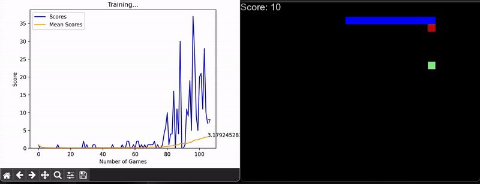

# Neuro_Snake

Neuro_Snake is an AI-enhanced implementation of the classic Snake game, using Deep-Q-Network Learning. The agent uses a neural network to learn optimal strategies for navigating the grid, collecting food, and avoiding collisions. With continuous training, the model improves its decision-making by minimizing loss and maximizing cumulative rewards. 

## Requirements

Install requirements using the following command:

pip install -r requirements.txt

## Run the Code

cd src/
python agent.py

## AI Training
