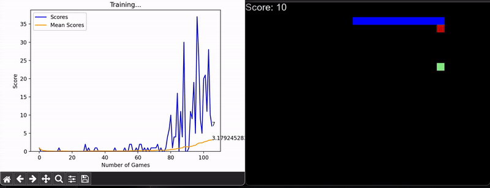
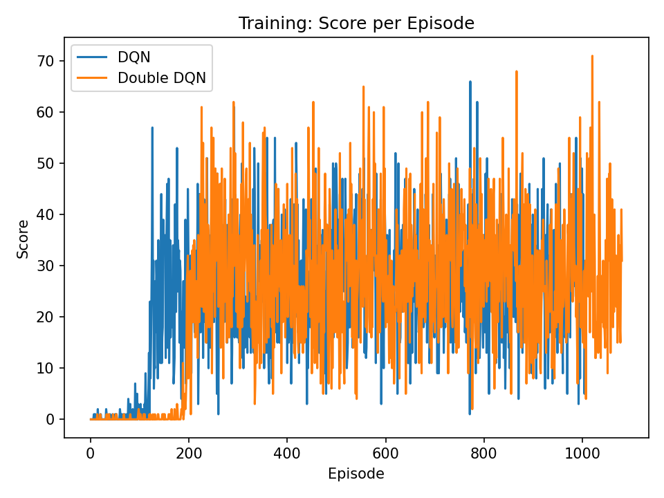
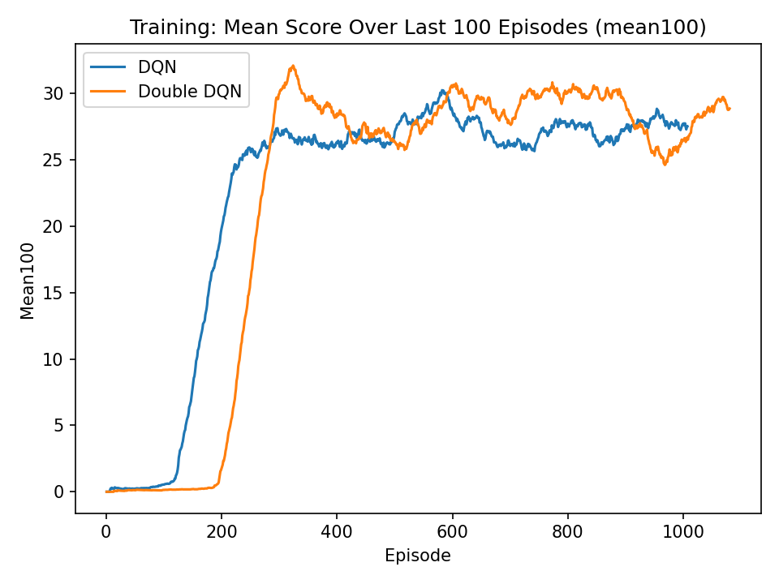
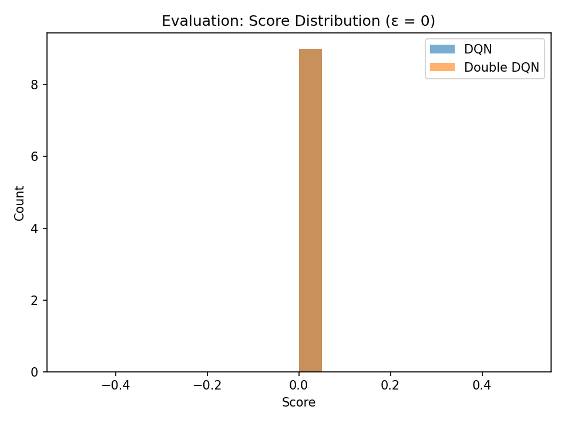
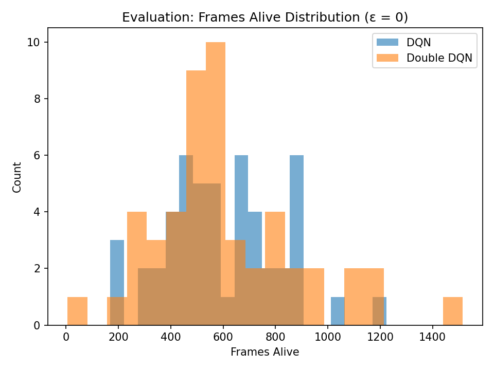

# Neuro_Snake 🐍🤖



**Neuro_Snake** is an AI-enhanced implementation of the classic Snake game, built to demonstrate **reinforcement learning in practice**.  
The project trains an agent to play Snake using **Deep Q-Networks (DQN)** and **Double Deep Q-Networks (Double DQN)**, and provides a **side-by-side comparison** of the two algorithms.

This repository showcases:
- how reinforcement learning can be applied to games
- a clean implementation of DQN and Double DQN
- reproducible training, evaluation, and comparison pipelines

---

## Environment
- **Python version:** **Python 3.9**
- **Frameworks/Libraries:** PyTorch, NumPy, Pygame, Matplotlib, Pandas

Install dependencies:
```bash
pip install -r requirements.txt
```

---

## Project Overview

The Snake agent learns through **trial and error**:

* observes the current game state
* chooses an action (move straight, turn left, turn right)
* receives rewards:

  * **+10** for eating food
  * **−10** for collisions (game over)

Over time, the agent learns to:

* navigate safely
* grow longer
* survive for more frames
* achieve higher scores


## Algorithms Implemented

### Deep Q-Network (DQN)

DQN approximates the action-value function ( Q(s, a) ) using a neural network:

$$
Q(s, a) = r + \gamma \max_{a'} Q(s', a')
$$

Key ideas:

* a neural network predicts Q-values for all actions
* actions are chosen using an ε-greedy policy
* experience replay improves training stability

**Limitation:**
DQN often **overestimates Q-values**, because the same network is used to both select and evaluate the best action.

---

### Double Deep Q-Network (Double DQN)

Double DQN addresses Q-value overestimation by separating **action selection** from **action evaluation**:

$$
Q(s, a) = r + \gamma Q_{\text{target}}\big(s', \arg\max_{a'} Q_{\text{online}}(s', a')\big)
$$

How it works:

* the **online network** selects the best next action
* the **target network** evaluates that action
* the target network is periodically synced with the online network

**Benefits:**

* reduced overestimation bias
* more stable learning
* improved long-term performance

---

## Neural Network Architecture

* Input: **11-dimensional state representation**
* Hidden layer: **512 units (ReLU)**
* Output: **3 Q-values** (straight, left, right)

---

## Repository Structure

```
.
├── agent.py          # Training & evaluation logic
├── game.py           # Pygame Snake environment
├── model_dense.py    # Q-network & trainer (DQN / Double DQN)
├── compare.py        # Compare DQN vs Double DQN results
├── config.py         # Centralized configuration
├── utils_seed.py     # Reproducibility utilities
├── utils_logger.py   # CSV logging
├── runs/             # Training & evaluation outputs
│   ├── dqn/
│   └── double_dqn/
└── README.md
```

---

## Running the Code

### Training

Train the agent using **DQN**:

```bash
python agent.py --algo dqn --seed 42 --run_name baseline
```

Train the agent using **Double DQN**:

```bash
python agent.py --algo double_dqn --seed 42 --run_name baseline
```

During training:

* the Pygame window is rendered
* the window title indicates the algorithm:

  * `Neuro_Snake - DQN`
  * `Neuro_Snake - Double DQN`
* training metrics are logged to:

  ```
  runs/<algo>/<run_name>/metrics.csv
  ```

---

### Evaluation (No Training)

Evaluate a trained model using a greedy policy (ε = 0).

Evaluate DQN:

```bash
python agent.py --algo dqn --seed 42 --run_name baseline --eval --episodes 50
```

Evaluate Double DQN:

```bash
python agent.py --algo double_dqn --seed 42 --run_name baseline --eval --episodes 50
```

Evaluation results are saved to:

```
runs/<algo>/<run_name>/eval.csv
```

### Device Support (CPU / GPU)

Neuro_Snake automatically supports CPU and GPU execution using PyTorch.

By default, the project runs on:
- GPU (CUDA) if available
- CPU otherwise

You can explicitly control the device using the --device flag.

Automatic device selection (recommended)
```
python agent.py --algo dqn --run_name baseline
```

#### Force CPU
```
python agent.py --algo dqn --run_name baseline --device cpu
```

#### Force GPU (CUDA)
```
python agent.py --algo dqn --run_name baseline --device cuda
```
⚠️ Forcing cuda will raise an error if no CUDA-enabled GPU is available.

---
### Notes on Reproducibility and Variance

Because the Snake environment is **stochastic** (for example, food placement is random) and reinforcement learning dynamics are inherently **chaotic**, individual game runs may produce different scores even when using the same trained model.

Restarting the program and re-running evaluation does not guarantee identical episode outcomes. Small differences early in an episode (such as food spawn location) can lead to entirely different trajectories later.

For this reason, performance is evaluated using:
- **multiple episodes**
- **average score and standard deviation**, rather than a single run

*Consistent performance across many evaluation episodes indicates that the agent has learned a **robust policy**, rather than memorizing a fixed sequence of actions.*


### Comparison

After training and evaluation, compare both algorithms:

```bash
python compare.py --run_name baseline
```

This generates comparison plots:

```
runs/compare_baseline_score.png
runs/compare_baseline_mean100.png
```

---

## Purpose of This Repository

This project demonstrates how **reinforcement learning can be applied to game-playing agents**, with:

* a clear and interactive environment
* reproducible experiments
* a direct comparison between DQN and Double DQN

It is intended as:

* a learning resource for reinforcement learning
* a reference implementation of DQN vs Double DQN
* a portfolio-quality project showcasing applied RL


# Results

Both algorithms were trained for **1,000 episodes** using seed `42` and the same neural network architecture (11 inputs → 512 hidden units → 3 outputs). After training, each model was evaluated over **50 greedy episodes** (ε = 0) to measure true learned performance.

---

## Training Performance

### Score per Episode


Both agents score near 0 for the first ~150 episodes while the exploration rate is high. DQN begins learning around episode 100, while Double DQN catches up rapidly around episode 220. Double DQN reaches a higher peak training score (**71**) compared to DQN (**66**).

### Rolling Mean — Last 100 Episodes


Double DQN peaks at a higher rolling mean (~32) and stabilizes around ~29. DQN converges slightly earlier but plateaus at a lower average (~27). Both algorithms show clear convergence after ~400 episodes.

---

## Evaluation Results (ε = 0, 50 episodes)

### Score Distribution


### Frames Alive Distribution


---

## Summary Table

| Metric | DQN | Double DQN |
|---|---|---|
| Training episodes | 1,000 | 1,000 |
| Peak training score | 66 | 71 |
| Avg evaluation score | **29.78** | 28.98 |
| Std deviation | ±9.77 | ±11.76 |
| Max evaluation score | 59 | **65** |
| Min evaluation score | 9 | 2 |
| Median evaluation score | 28.0 | 26.5 |
| Avg frames alive | 595.8 | **609.6** |
| Max frames alive | 1,223 | **1,515** |
| Scored 20+ | **88%** of games | 80% of games |
| Scored 40+ | 16% of games | **18%** of games |

---

## Key Takeaways

**DQN** achieved a slightly higher average evaluation score (29.78 vs 28.98) and was more consistent, with a lower standard deviation (±9.77 vs ±11.76) and a higher rate of games scoring 20 or above (88% vs 80%).

**Double DQN** showed a higher performance ceiling — reaching a peak score of 65 (vs 59) and surviving up to 1,515 frames (vs 1,223). This aligns with the theoretical benefit of Double DQN: reduced Q-value overestimation leads to better long-run behaviour, even if convergence is noisier.

Both agents far outperform random play, consistently scoring 20–40 points per game across evaluation episodes. The results demonstrate that both DQN and Double DQN successfully learn robust navigation policies within 1,000 training episodes.
